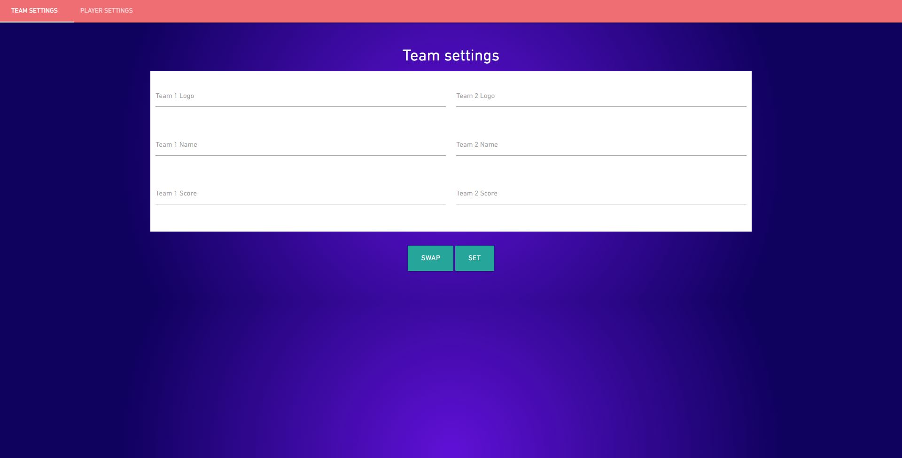
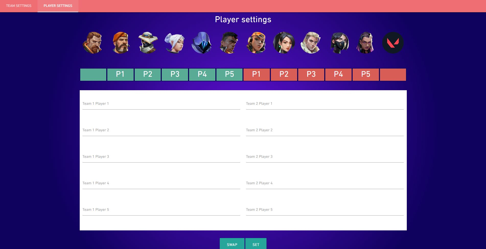
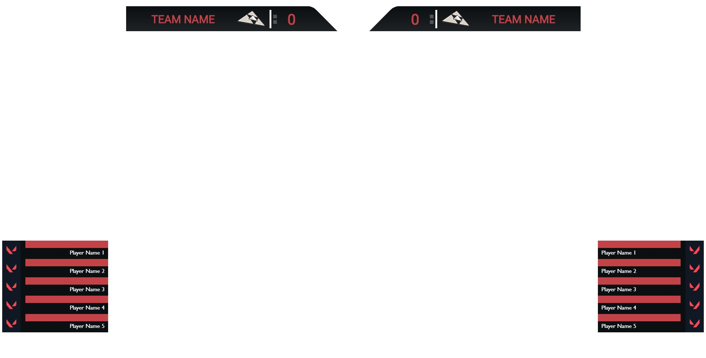

# Acheron

This product is aimed at improving the viewing experience in Valorant by providing data that can be used to create a custom HUD that can be integrated to a live broadcast.

It is using computer vision to gather information on the game (hp of the players, round time, and scores).

Only a bandaid until Riot releases a better way to do this (local telemetry data, game API, spectator API...)

## Example

## Running Acheron
- python AcheronObs.py
- java -jar acheron_overlay.jar

**You need to create a 'config.json' file, see AcheronObs.py to see what's needed in this file.
Don't forget to install the required libraries listed in AcheronObs.py aswell as Tesseract OCR.**

You can access the HUD at localhost:PORT/overlay and the Dashboard at localhost:PORT/dashboard.
The API is accessible at localhost:PORT/api/123.
Default port is 6543.

It requires OBS Virtual Cam. Launch OBS, add Virtual Cam filter to the game capture and start the camera before AcheronObs.

It requires the second observer to stand in a black corner of the map to work accurately. 

## More screenshots

Not for commercial use, contact me if you're interested in using it commercialy. https://twitter.com/aAa_pechz

 Ce(tte) œuvre est mise à disposition selon les termes de la <a rel="license" href="http://creativecommons.org/licenses/by-nc-sa/4.0/">Licence Creative Commons Attribution - Pas d’Utilisation Commerciale - Partage dans les Mêmes Conditions 4.0 International</a>.

